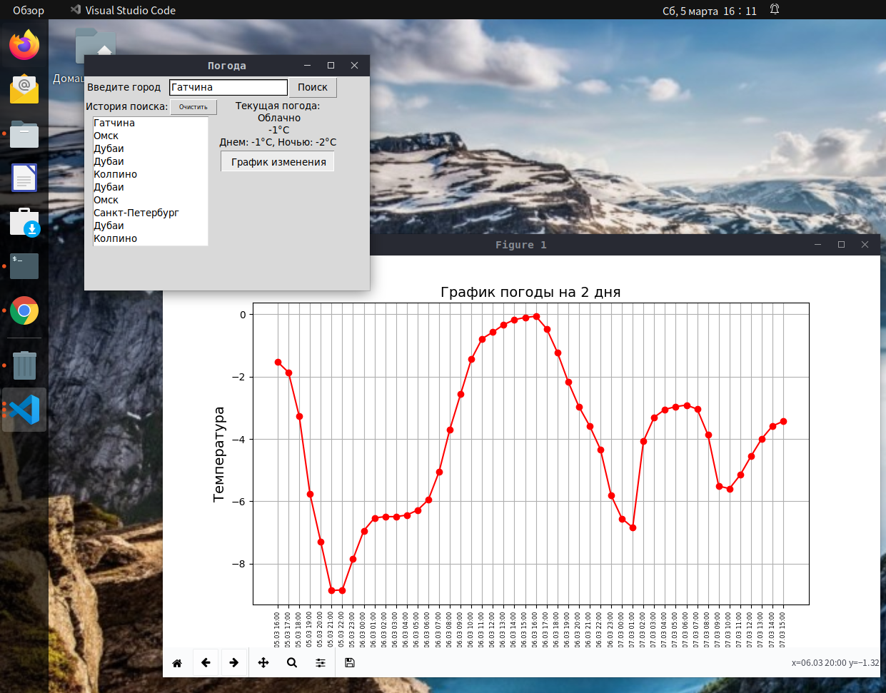

# Настольное приложение погоды

Данное приложение показывает текущую погоду и график изменения погоды на 2 дня.

__Используемый API__: 

[OpenWeatherMap](https://openweathermap.org/)

### Данное приложение реализует:
- запросы к серверу
- хранение истории запросов в базе (sqlite)
- асинхронные запросы
- графический интерфейс



## Установка

Скачайте архив, установите необходимые библиотеки ( см. requirements.txt)

```
tkinter==8.6
aiohttp==3.8.1
matplotlib==3.5.1
```

## Используемые запросы

```python
# Список городов
http://api.openweathermap.org/geo/1.0/direct?q={city name},{state code},{country code}&limit={limit}&appid={API key}

# Текущая погода
htpp://api.openweathermap.org/data/2.5/weather?lat={lat}&lon={lon}&appid={API key}

# Для погоды на 2 дня вперед
https://api.openweathermap.org/data/2.5/onecall?lat={lat}&lon={lon}&exclude={part}&appid={API key}

```

## Файл запуска - main.py